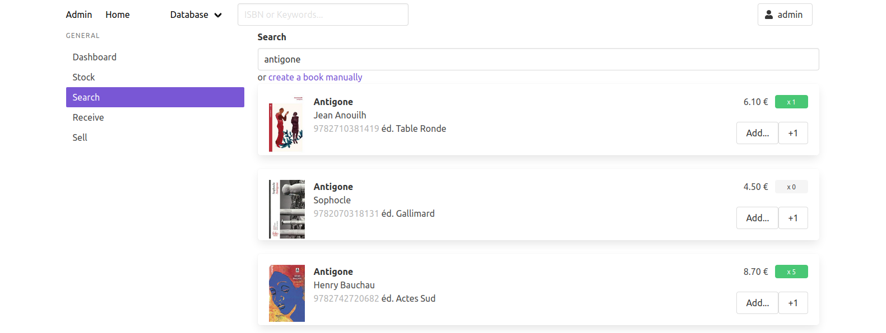
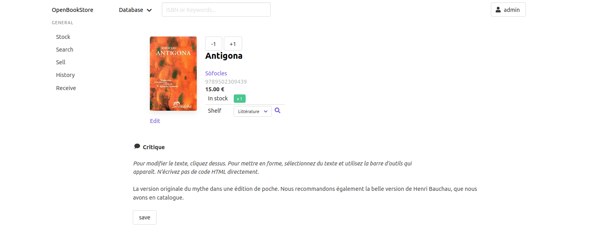
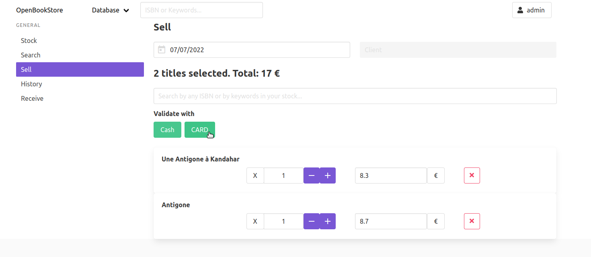
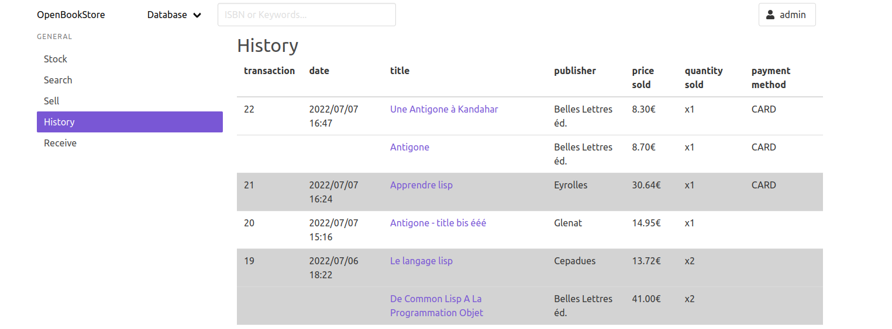

[](https://gitter.im/openbookstore-developers/community?utm_source=badge&utm_medium=badge&utm_campaign=pr-badge)


<p>
  <h2 align="center"> OpenBookStore </h2>
  <h3 align="center"> Book management software </h3>
</p>

<p align="center">
  <a href="https://github.com/OpenBookStore/openbookstore"><b>Homepage</b></a> |
  <a href="https://gitlab.com/MyOpenBookStore/openbookstore/issues"><b>Issues</b></a> |
  <a href="https://gitter.im/openbookstore-developers/community?utm_source=share-link&utm_medium=link&utm_campaign=share-link"><b>Gitter chat</b></a> |
  <a href="https://github.com/sponsors/vindarel"><b>Support us!</b></a> |
  <a href="https://ko-fi.com/vindarel"><b>Buy me a coffee!</b></a> |
  <a href="/README_fr.md">Français</a>
</p>

In development. Starts being testable.

Command line interface and web UI to search for books, add them to your stock, sell, see the history, etc.


<!-- markdown-toc start - Don't edit this section. Run M-x markdown-toc-refresh-toc -->
**Table of Contents**

- [Installation](#installation)
    - [Download a binary (WIP)](#download-a-binary-wip)
    - [Run from sources](#run-from-sources)
- [Running it](#running-it)
    - [Web UI](#web-ui)
    - [Command line](#command-line)
    - [Readline interface](#readline-interface)
    - [Lisp REPL](#lisp-repl)
    - [Run at startup with Systemd](#run-at-startup-with-systemd)
- [Usage](#usage)
    - [Bibliographic search, adding books to your stock](#bibliographic-search-adding-books-to-your-stock)
    - [What's in a book?](#whats-in-a-book)
    - [Seeing your stock](#seeing-your-stock)
    - [Selling books, history](#selling-books-history)
    - [History (of sells)](#history-of-sells)
    - [Places](#places)
    - [Lending books to contacts](#lending-books-to-contacts)
    - [Stats](#stats)
    - [Settings](#settings)
- [High-level goals](#high-level-goals)
    - [i18n](#i18n)
- [Dev](#dev)
    - [Testing](#testing)
    - [Troubleshooting](#troubleshooting)
    - [Translations](#translations)
        - [How to add a new locale?](#how-to-add-a-new-locale)
        - [How to add a translation for an existing string?](#how-to-add-a-translation-for-an-existing-string)
        - [More technical details](#more-technical-details)
- [Lisp ?!](#lisp-)
- [See also](#see-also)
- [Licence](#licence)

<!-- markdown-toc end -->

# Installation

## Download a binary (WIP)

Download the standalone executable from [here](https://gitlab.com/myopenbookstore/openbookstore/-/jobs/artifacts/master/download?job=build) (warn: beta).

It's a 24MB self-contained executable (for Debian Buster GNU/Linux,
x86/64 platform). You don't need to install a Lisp implementation to run
it. Unzip the archive and run `openbookstore` from the `bin/`
directory.

There is a system dependency to install. On Debian: `apt install sqlite3`

## Run from sources

Alternatively, install `sbcl` with your package manager:

    apt install sbcl rlwrap

install Quicklisp, the Lisp library manager ([full instructions](https://www.quicklisp.org/beta/#installation)):

    curl -O https://beta.quicklisp.org/quicklisp.lisp && sbcl --load quicklisp.lisp --eval '(quicklisp-quickstart:install)' --eval '(ql:add-to-init-file)' --quit &> /dev/null
    rm quicklisp.lisp

clone the repository:

    git clone https://gitlab.com/myopenbookstore/openbookstore.git

Then, to run the software, you have 2 options: build a binary or run it from sources.

# Running it

## Web UI

To run the web application:

- run it **from the binary**. Either download it from GitLab as seen above either build it (`make build`), then run it (the binary is created in a `bin/` directory):

```
./bin/bookshops -w [--port 4242] [--verbose]
```

To create a user with admin rights, run:

    /bookshops --manage createsuperuser

and follow the prompt.

- run it **from sources**:

```
make run
```

aka `rlwrap sbcl --load run.lisp`. You can set the port with the environment variable `OBS_PORT` (defaults to 4242).

Quit with `C-d`.

- run it from the REPL:

```
(bookshops/web:start-app :port 4242)
```

- initialize the database if not already done, see above.
- to create a superuser from the Lisp REPL, use `(bookshops.manager::add-superuser)`.



## Command line

We can run OpenBookStore without a graphical interface.

We can use it to search for books data on internet sources:

    $ ./bookshops search terms

see `--help` for the available options.

## Readline interface

We can use OpenBookStore with a simple readline-based terminal interface.

Get a readline interactive prompt with the `-i` flag:

```
$ ./bookshops -i
bookshops >
```

See the available commands with `help`, the documentation of a given command with `help <cmd>` (see `help help`, use TAB-completion).

At any moment, quit the current prompt with `C-d` (control-d) or use:

- `quit`

To search for books on the internet sources, use `search`:


## Lisp REPL

We can start OpenBookStore from a Common Lisp REPL, from our preferred editor, and modify it on-the-fly. The editor can be Emacs with Slime, Atom with SLIMA, Vim with Slimv, VSCode with Alive etc.

Load the system definition, `bookshops.asd`, with C-c C-k in Slime,

Load the dependencies: `(ql:quickload "bookshops")`,

Create the DB: `(bookshops.models::initialize-database)`

Create a superuser: `(bookshops.models::create-superuser name email password)`

Connect to the DB: `(bookshops:init)`

then explore commands in `bookshops.commands`.

You might need to enable terminal colors with `M-x slime-repl-ansi-on` ([see here](https://github.com/enriquefernandez/slime-repl-ansi-color)).

## Run at startup with Systemd

In a new `/etc/systemd/system/openbookstore.service`:

```
[Unit]
Description=OpenBookStore

[Service]
Restart=on-failure
WorkingDirectory=/home/you/path/to/repository
# We run the binary: (absolute path)
ExecStart=/home/you/path/to/repository/openbookstore --web --port 4242
User=openbookstore  # or an existing user
Type=simple
Restart=on-failure

[Install]
WantedBy=multi-user.target  # start at reboot.
```

start it:

    systemctl start openbookstore.service

to see the logs:

    journalctl -u openbookstore.service [--since today] [--no-pager] [-o json-pretty] [-f]

use `-f` to follow the logs as they are written.


# Usage

Below is an overview of the available features in the web app and in the terminal interface.

## Bibliographic search, adding books to your stock

In the web app, go to the "Search" menu on the left.

You can search anything by keywords or by ISBN (you can scan a book in
every search input of OpenBookStore). The search will return the
required bibliographic data (title, author(s), publisher, ISBN…) as
well as the book's price and the cover image. However, these last two
data depend on the datasource you use.

The currently available datasources are:

- french datasource

In addition, for each book found, you will see a little button that tells you if you already have this title in stock, and how many.

Click on the "+1" button to add this book to your stock.


In the **terminal interface**, use `search`:

- `search <search terms or ISBN>`

It fetches bibliographic information on online sources and prints a
list of results. Add one to your stock:

- `add <i>`

Or create a book manually:

- `create`

To cancel the form, use `C-d` (control-d), or enter nothing in a
mandatory field (showed like in web forms with a red asterisk).

See also

- `delete <i>`

## What's in a book?

A book has these fields:

- title
- author(s)
- EAN13
- public price
- quantity in stock
- shelf
- your review, that you can edit on the book's page with a WYSIWYG editor.




## Seeing your stock

To search the books you have in stock, use the "Stock" menu in the web
app, or use the search input in the top navigation bar.


In the **terminal interface**, use `stock`:

- `stock [keyword]`, with an optional keyword you can **filter by titles**.

This prints a list of results with at most `*page-size*` elements. Use
the two commands for pagination:

- `next` and
- `previous`.

To see more information about one book you have in stock:

- `details <id>`: print more information about the book of
 id `<id>`.
- `details <Title>`: you can TAB-complete the title.

As with several commands, you can autocomplete the id argument using
the TAB key. The choices are the ids displayed on the last `stock`
command, so this can be handy when you have filtered the results.

## Selling books, history

In the web app, go to the "Sell" menu.

You can scan any book in the search input that is already selected,
and you can search books already in your stock with the keyboard (3
letters are necessary to trigger a search).

Once you're ready, click a payment method button to validate the transaction.



What remains to be done:

- register the sell for a client, handle three payment methods, generate a PDF bill…


## History (of sells)

You can find all your sell transactions in the History.



What remains to be done:

- see the history by month, by day, simple stats…


## Places

*Note: we don't encourage the use of multiple places, it only renders your stock management more difficult*

When you start the program, you are in the "default place". See that
the command prompt displays `(default place) bookshops > `: it shows the
current place you are in.

This current place plays the role of the *origin place* for the mentioned commands below.

To create a place, use

- `create place` (use TAB-completion, you currently have the choice between "book" (by default) or "place")

To change the current place:

- `inside [place]`: print the current place we manipulate the books
  from. With an optional argument, change to it (use TAB completion for the name of the places).

To move a book to another place:

- `move <book id> place [xi]`: move a book to another place. The place of origin is the one we are currently in (see `inside`). Give the quantity to move with for example "x2" at the end of the query. Example: `move 3 bedroom x2`.

See the list of places:

- `places`: lists the existing places with their number of books and their total cost.

## Lending books to contacts

In the **web UI**, the dashboard shows which loans are outdated (their due date was due before today).

In the **terminal app**, lend a book to someone like so:

- `lend <id> <contact name>`

See your contacts, their books and the date they borrowed them:

- `contacts`

The same information, but a list of books sorted by date (oldest first):

- `loans [optional contact name]`

In both commands, a book that was borrowed more than 60 days is
printed in red.

and when your friend returns a book back:

- `receive <book id> [optional contact name]`

In **Lisp**, get them with:

~~~lisp
(bookshops.models::loans)
;; and
(bookshops.models::outdated-loans)
~~~


## Stats

Get some numbers about your stock:

- `stats`: some numbers. Percentage of books without isbn. With optional parameters to print the related results:
  - `noisbn`: prints the books that have no isbn.
  - `negative`: prints the books that have a negative stock, and
    where. This can happen if you move some books but you forgot to
    register them.


## Settings

The parameters can be changed with `set`.

The follownig settings currently exist:

- `*page-size*`


# High-level goals

Be more useful and easier to install and use than our Abelujo web app.

- [X] single-file binaries: DONE. Thanks, Common Lisp.
- [X] readline UI
- [X] Web interface (~~with Weblocks~~)
  - [X] search the stock
  - [X] search new books
  - [X] sell view
  - [X] history of sells
  - all the rest
- GUI (postponed)
  - [X] proof of concept with LTk
  - use a GUI running on a remote server (see [ltk-remote](http://www.peter-herth.de/ltk/ltkdoc/node46.html))
- [X] build an online catalogue for clients ([ABStock](http://abstock.org/))
- features:
  - sells, several places, list of commands, etc.
  - download a pdf of the stock, with barcodes
  - invoices
  - clients
  - etc


## i18n

This software is available in other languages than english.

See the makefile and `i18n-load` in `utils.lisp`.

NOTE: i18n is currently disabled in the released binary.


# Dev

We use (our) `replic` library to build the readline commands from existing Lisp functions:
https://github.com/vindarel/replic (which builds on cl-readline).

We use the [Mito](https://github.com/fukamachi/mito) ORM. See the [Cookbook tutorial](https://lispcookbook.github.io/cl-cookbook/databases.html).

<!-- ## Management commands -->

<!-- You can use: -->

<!-- - `manage <custom_command>` -->

<!-- to run custom commands. -->

<!-- And you can see some basic instructions on how to create your own commands -->
<!-- on file "src/manager.lisp" -->


## Testing

To test DB operations, use our macro `with-empty-db`.


```lisp
(use-package :bookshops.models)
(use-package :bookshops-test.utils)

(with-empty-db
   (let* ((bk (make-book :title "inside-test")))
     (save-book bk)))

;;  CREATE TABLE "book" (
;;     "id" INTEGER PRIMARY KEY AUTOINCREMENT,
;;     "datasource" VARCHAR(128),
;;     "title" VARCHAR(128) NOT NULL,
;;     "price" INTEGER,
;;     "date_publication" VARCHAR(128),
;;     "editor" VARCHAR(128),
;;     "authors" VARCHAR(128),
;;     "quantity" INTEGER,
;;     "created_at" TIMESTAMP,
;;     "updated_at" TIMESTAMP
;; ) () [0 rows] | EXECUTE-SQL
#<BOOK inside-test>
```

## Troubleshooting

- `DB is locked`: close and re-open: `(mito:disconnect-toplevel)` and `(bookshops.model:connect)`. => [fixed upstream](https://github.com/fukamachi/mito/pull/28#issuecomment-377450798) ?

## Translations

`make tr` takes care of extracting the strings (generating `.pot`
files) and generating or updating (with `msgmerge`) `.po` and `.mo`
files for each locale. The `.mo` files are loaded in the lisp image at
compile-time (or run-time, when developing the application).

### How to add a new locale?

1. Add the new locale to the `LOCALES` variable in the makefile.
2. Call `make tr`. This will generate the `.po` file (and directory)
   for the new locale.

### How to add a translation for an existing string?

1. Update the `.po` file for the locale.
    1. Find the `msgid` that corresponds to the string you want to
       translate.
    2. Fill the `msgstr`.
2. Call `make tr` to update the `.mo` file for the locale.

### More technical details

- The majority of the code that deals with internationalization is in
  `i18n.lisp`. The rest is in `web.lisp`, where `djula` is configured
  to use `gettext` as a back-end.
- `djula` uses the special variable `djula:*current-language*` to
  determine which language to show.
- `gettext` uses the special variable `gettext:*current-locale*` to
  determine which language to show.
- `gettext` stores the translations in a hash-table named
  `gettext::*catalog-cache*`
- `gettext:setup-gettext` adds and export a few utilities in the given
  package.

# Lisp ?!

- http://common-lisp.net/
- http://lisp-lang.org/
- [awesome-cl](https://github.com/CodyReichert/awesome-cl) (and a list of [companies](https://github.com/azzamsa/awesome-lisp-companies) using CL)
- https://lispcookbook.github.io/cl-cookbook/
- [learn Common Lisp with this video course on Udemy](https://www.udemy.com/course/common-lisp-programming/?referralCode=2F3D698BBC4326F94358)

# See also

- https://gitlab.com/vindarel/abstock our online catalogue for public consumption

<!-- - https://github.com/jl2/bookdb/, which searches on isbndb.com (not good enough for us and lacking prices) -->

# Licence

AGPLv3
