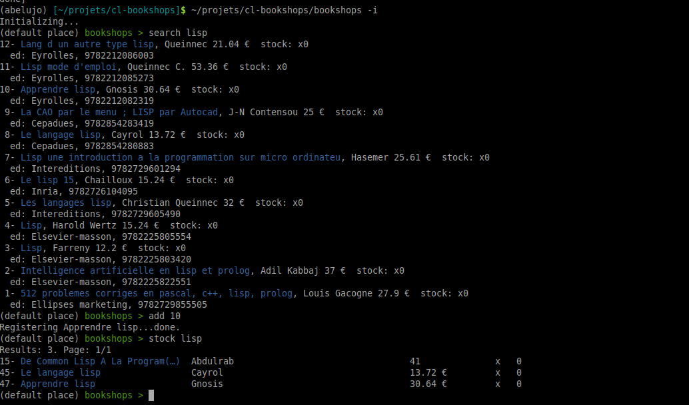

[](https://gitter.im/openbookstore-developers/community?utm_source=badge&utm_medium=badge&utm_campaign=pr-badge)


<p>
  <h2 align="center"> OpenBookStore </h2>
  <h3 align="center"> Book management software </h3>
</p>

<p align="center">
  <a href="https://github.com/OpenBookStore/openbookstore"><b>Homepage</b></a> |
  <a href="https://gitlab.com/MyOpenBookStore/openbookstore/issues"><b>Issues</b></a> |
  <a href="https://gitter.im/openbookstore-developers/community?utm_source=share-link&utm_medium=link&utm_campaign=share-link"><b>Gitter chat</b></a> |
  <a href="https://www.patreon.com/abelujo"><b>Support us on Patreon</b></a> |
  <a href="https://liberapay.com/vindarel/donate"><b>Support us on Liberapay</b></a> |
  <a href="https://ko-fi.com/vindarel"><b>Buy me a coffee!</b></a> |
  <a href="/README_fr.md">Français</a>
</p>

In development. Starts being testable.


<!-- markdown-toc start - Don't edit this section. Run M-x markdown-toc-refresh-toc -->
**Table of Contents**

- [Bookshops](#bookshops)
    - [Installation](#installation)
    - [Usage](#usage)
        - [Web UI](#web-ui)
        - [Command line](#command-line)
        - [GUI](#gui)
        - [Lisp REPL](#lisp-repl)
        - [Bibliographic search, adding books to your stock](#bibliographic-search-adding-books-to-your-stock)
        - [Seeing the stock, pagination](#seeing-the-stock-pagination)
        - [Places](#places)
        - [Lending books to contacts](#lending-books-to-contacts)
        - [Stats](#stats)
        - [Settings](#settings)
    - [High-level goals](#high-level-goals)
    - [i18n](#i18n)
    - [Dev](#dev)
        - [Creating custom commands for the binary application](#creating-custom-commands-for-the-binary-application)
        - [Testing](#testing)
        - [Troubleshooting](#troubleshooting)
- [Lisp ?!](#lisp-)
- [See also](#see-also)
- [Licence](#licence)

<!-- markdown-toc end -->


## Installation

Download the executable from https://gitlab.com/vindarel/cl-bookshops/pipelines (download a build artifact with the button on the right).

It's a 24MB self-contained executable (for Debian GNU/Linux,
x86/64). You don't need to install a Lisp implementation nor anything
to run it.

Alternatively, install `sbcl` with your package manager, Quicklisp, clone the repository and either build the executable:

    make build

or run from sources:

    make run  # aka sbcl --load run.lisp

There is a toy Tk GUI.


## Usage

### Web UI

To run the web application:

- run it from the binary. Either download it from GitLab either build it (`make build`), then run it:

    ./bookshops -w [--port 8989] [--verbose]

- run it from sources:

    make run

aka `sbcl --load run.lisp`. You can set the port with the environment variable `OBS_PORT` (defaults to 4242).

Quit with `C-d`.

- run it from the REPL:

    (bookshops-web:start-app :port 8989)


Create a superuser from the REPL:

    (bookshops.models::create-superuser name email password)

### Command line

    ./bookshops search terms

get a readline interactive prompt:

    ./bookshops -i
    bookshops > help

See the available commands with `help`, the documentation of a given command with `help <cmd>` (see `help help`, use TAB-completion).

At any moment, quit the current prompt with `C-d` (control-d) or use:

- `quit`




### GUI

A useless Tk GUI built for learning purposes.

    ./bookshops-gui &

or from the REPL: load `bookshops/gui` and run `bookshops.gui:main`.

You can't do much !

### Lisp REPL

Load `bookshops.asd` (C-c C-k in Slime), Quickload the system
(`(ql:quickload "bookshops")`), then initialize the DB connection and
the translations with `(bookshops:init)`, then explore commands in
`bookshops.commands`, like `stock`.

You might need to enable terminal colors with `M-x slime-repl-ansi-on` ([see here](https://github.com/enriquefernandez/slime-repl-ansi-color)).


### Bibliographic search, adding books to your stock

You can begin to search for books:

- `search <search terms or ISBN>`

It fetches bibliographic information on online sources and prints a
list of results. Add one to your stock:

- `add <i>`

Or create a book manually:

- `create`

To cancel the form, use `C-d` (control-d), or enter nothing in a
mandatory field (showed like in web forms with a red asterisk).

See also

- `delete <i>`

### Seeing the stock, pagination

To see your stock:

- `stock [keyword]`, with an optional keyword you can **filter by titles**.

This prints a list of results with at most `*page-size*` elements. Use
the two commands for pagination:

- `next` and
- `previous`.

To see more information about one book you have in stock:

- `details <id>`: print more information about the book of
 id `<id>`.
- `details <Title>`: you can TAB-complete the title.

As with several commands, you can autocomplete the id argument using
the TAB key. The choices are the ids displayed on the last `stock`
command, so this can be handy when you have filtered the results.

### Places

When you start the program, you are in the "default place". See that
the command prompt displays `(default place) bookshops > `: it shows the
current place you are in.

This current place plays the role of the *origin place* for the mentioned commands below.

To create a place, use

- `create place` (use TAB-completion, you currently have the choice between "book" (by default) or "place")

To change the current place:

- `inside [place]`: print the current place we manipulate the books
  from. With an optional argument, change to it (use TAB completion for the name of the places).

To move a book to another place:

- `move <book id> place [xi]`: move a book to another place. The place of origin is the one we are currently in (see `inside`). Give the quantity to move with for example "x2" at the end of the query. Example: `move 3 bedroom x2`.

See the list of places:

- `places`: lists the existing places with their number of books and their total cost.

### Lending books to contacts

Lend a book to someone:

- `lend <id> <contact name>`

See your contacts, their books and the date they borrowed them:

- `contacts`

The same information, but a list of books sorted by date (oldest first):

- `loans`

In both commands, a book that was borrowed more than 60 days is
printed in red.

and when your friend returns a book back:

- `receive <book id> [optional contact name]`


### Stats

Get some numbers about your stock:

- `stats`: some numbers. Percentage of books without isbn. With optional parameters to print the related results:
  - `noisbn`: prints the books that have no isbn.
  - `negative`: prints the books that have a negative stock, and
    where. This can happen if you move some books but you forgot to
    register them.


### Settings

The parameters can be changed with `set`.

The follownig settings currently exist:

- `*page-size*`


## High-level goals

Be more useful and easier to install and use than our Abelujo web app.

- [X] single-file binaries: DONE. Thanks, Common Lisp.
- GUI
  - [X] proof of concept
- connect to a remote DB
- use a GUI running on a remote server (see [ltk-remote](http://www.peter-herth.de/ltk/ltkdoc/node46.html))
- [X] searching one's stock from a web interface (~~with Weblocks~~)
- [X] build an online catalogue for clients (ABStock)
- sells, several places, list of commands, etc.
- download a pdf of the stock, with barcodes
- invoices
- clients
- etc


## i18n

This software is available in other languages than english.

See the makefile and `i18n-load` in `utils.lisp`.


## Dev

We use (our) `replic` library to build quickly the readline interactive prompt:
https://github.com/vindarel/replic (which builds on cl-readline).

We use the [Mito](https://github.com/fukamachi/mito) ORM. See the [Cookbook tutorial](https://lispcookbook.github.io/cl-cookbook/databases.html).

Model usage:

```lisp
(in-package :bookshops.model)
(use-package '(:mito :sxql))

(connect)
(i18n-load)

(make-book :title "antigone" :datasource "xxx")

(save-book *)

(find-dao 'book)
;; => #<Book antigone>

(select-dao 'book
    (where (:like :title "%ti%")))
```

Slots: `title`... `quantity`, etc.

### Creating custom commands for the binary application

You can use:

- `manage <custom_command>`

to run custom commands.

And you can see some basic instructions on how to create your own commands
on file "src/manager.lisp"


### Testing

To test DB operations, use our macro `with-empty-db`.


```lisp
(use-package :bookshops.models)
(use-package :bookshops-test.utils)

(with-empty-db
   (let* ((bk (make-book :title "inside-test")))
     (save-book bk)))

;;  CREATE TABLE "book" (
;;     "id" INTEGER PRIMARY KEY AUTOINCREMENT,
;;     "datasource" VARCHAR(128),
;;     "title" VARCHAR(128) NOT NULL,
;;     "price" INTEGER,
;;     "date_publication" VARCHAR(128),
;;     "editor" VARCHAR(128),
;;     "authors" VARCHAR(128),
;;     "quantity" INTEGER,
;;     "created_at" TIMESTAMP,
;;     "updated_at" TIMESTAMP
;; ) () [0 rows] | EXECUTE-SQL
#<BOOK inside-test>
```

### Troubleshooting

- `DB is locked`: close and re-open: `(mito:disconnect-toplevel)` and `(bookshops.model:connect)`. => [fixed upstream](https://github.com/fukamachi/mito/pull/28#issuecomment-377450798) ?

# Lisp ?!

- http://common-lisp.net/
- http://lisp-lang.org/
- https://github.com/CodyReichert/awesome-cl (and [companies](https://github.com/azzamsa/awesome-lisp-companies))
- https://lispcookbook.github.io

# See also

- https://gitlab.com/vindarel/abstock our online catalogue for public consumption
- https://github.com/jl2/bookdb/, which searches on isbndb.com (not good enough for us and lacking prices)

# Licence

AGPLv3

<a href="https://www.patreon.com/bePatron?u=36390714" data-patreon-widget-type="become-patron-button">Become a Patron!</a> or [buy me a coffee :)](https://ko-fi.com/vindarel)
