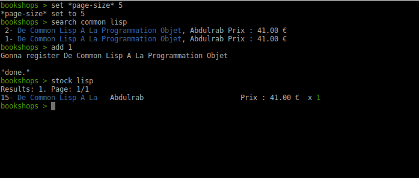

# Bookshops

In development, don't look.


## Usage

    make build

    ./bookshops search terms

get a readline interactive prompt:

    ./bookshops -i
    bookshops > help

See the available commands with `help`, the documentation of a given command with `help <cmd>` (see `help help`, use TAB-completion).

At any moment, quit the current prompt with `C-d` (control-d) or use:

- `quit`



### Bibliographic search, adding books to your stock

You can begin to search for books:

- `search <search terms or ISBN>`

It fetches bibliographic information on online sources and prints a
list of results. Add one to your stock:

- `add <i>`

Or create a book manually:

- `create`

To cancel the form, use `C-d` (control-d), or enter nothing in a
mandatory field (showed like in web forms with a red asterisk).

See also

- `delete <i>`

### Seeing the stock, pagination

To see your stock:

- `stock [keyword]`, with an optional keyword you can **filter by titles**.

This prints a list of results with at most `*page-size*` elements. Use
the two commands for pagination:

- `next` and
- `previous`.

To see more information about one book you have in stock:

- `details <id>`: print more information about the book of
 id `<id>`.

As with several commands, you can autocomplete the id argument using
the TAB key. The choices are the ids displayed on the last `stock`
command, so this can be handy when you have filtered the results.

### Places

When you start the program, you are in the "default place". See that
the command prompt displays `(default place) bookshops > `: it shows the
current place you are in.

This current place plays the role of the *origin place* for the mentioned commands below.

To create a place, use

- `create place` (use TAB-completion, you currently have the choice between "book" (by default) or "place")

To change the current place:

- `inside [place]`: print the current place we manipulate the books
  from. With an optional argument, change to it (use TAB completion for the name of the places).

To move a book to another place:

- `move <book id> place [xi]`: move a book to another place. The place of origin is the one we are currently in (see `inside`). Give the quantity to move with for example "x2" at the end of the query. Example: `move 3 bedroom x2`.

See the list of places:

- `places`: lists the existing places with their number of books and their total cost.

### Lending books to contacts

Lend a book to someone:

- `lend <id> <contact name>`

See your contacts, their books and the date they borrowed them:

- `contacts`

The same information, but a list of books sorted by date (oldest first):

- `loans`

and when your friend returns a book back:

- `receive <book id> [optional contact name]`


### Stats

Get some numbers about your stock:

- `stats`: some numbers. Percentage of books without isbn. With optional parameters to print the related results:
  - `noisbn`: prints the books that have no isbn.
  - `negative`: prints the books that have a negative stock, and
    where. This can happen if you move some books but you forgot to
    register them.


### Settings

The parameters can be changed with `set`.

The follownig settings currently exist:

- `*page-size*`


## i18n

This software is available in other languages than english.

See the makefile and `i18n-load` in `utils.lisp`.


## Dev

We use (our) `replic` library to build quickly the readline interactive prompt:
https://github.com/vindarel/replic (which builds on cl-readline).

We use the [Mito](https://github.com/fukamachi/mito) ORM. See the [Cookbook tutorial](https://lispcookbook.github.io/cl-cookbook/databases.html).

Model usage:

```lisp
(in-package :bookshops.model)
(use-package '(:mito :sxql))

(connect)
(i18n-load)

(make-book :title "antigone" :datasource "xxx")

(save-book *)

(find-dao 'book)
;; => #<Book antigone>

(select-dao 'book
    (where (:like :title "%ti%")))
```

Slots: `title`... `quantity`, etc.

### Testing

To test DB operations, use our macro `with-empty-db`.

(a clue it is working is that it should output migrations)

```lisp
(use-package :bookshops.models)
(use-package :bookshops-test.utils)

(with-empty-db
   (let* ((bk (make-book :title "inside-test")))
     (save-book bk)))

;;  CREATE TABLE "book" (
;;     "id" INTEGER PRIMARY KEY AUTOINCREMENT,
;;     "datasource" VARCHAR(128),
;;     "title" VARCHAR(128) NOT NULL,
;;     "price" INTEGER,
;;     "date_publication" VARCHAR(128),
;;     "editor" VARCHAR(128),
;;     "authors" VARCHAR(128),
;;     "quantity" INTEGER,
;;     "created_at" TIMESTAMP,
;;     "updated_at" TIMESTAMP
;; ) () [0 rows] | EXECUTE-SQL
#<BOOK inside-test>
```

### Troubleshooting

- `DB is locked`: close and re-open: `(mito:disconnect-toplevel)` and `(bookshops.model:connect)`. => [fixed upstream](https://github.com/fukamachi/mito/pull/28#issuecomment-377450798) ?

# Lisp ?!

- http://lisp-lang.org/
- https://github.com/CodyReichert/awesome-cl (and [companies](https://github.com/azzamsa/awesome-lisp-companies))
- https://lispcookbook.github.io
